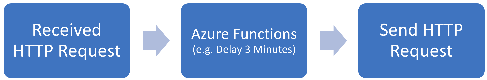
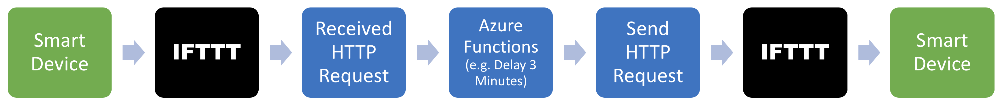
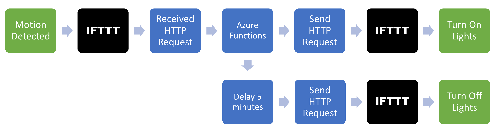

# Leo
_Qiu's Home Automation Solution with the Azure Functions_

We can easily do something like "Turn on the porch light when someone is at the front door" with smart home devices. However, it is not easy to find a way to turn off the light automatically after a delay (say, after 3 minutes). This Function App starts with providing a solution to turn on the devices for a certain amount of time.

This solution uses [Azure Functions](https://azure.microsoft.com/en-us/services/functions/) to run event-driven on-demand functions on the cloud. The main idea is to use Azure Functions to process and send HTTP requests. For example, a simple way of processing a request is to delay 3 minutes.



## Working with IFTTT
Not every smart home device has the ability to send/receive HTTP requests. However, most devices are able to connect with IFTTT service, which can be a bridge between the device and HTTP requests.

In IFTTT, we can connect devices with [Webhooks](https://ifttt.com/maker_webhooks), which enable us to create applets like:
* Send an HTTP request when an event (e.g. there is motion) is triggered.
* Trigger an action (e.g. turn off the light) when an HTTP request is received.

The project is designed to work with IFTTT to create automated workflow:



Azure function is also able to send out multiple requests with some pre-defined rules (e.g. one without delay and another with a 5-minute delay). This project includes Azure functions to automate tasks based on different rules. For example, with the [TurnOnDevice](docs/TurnOnDevice.md) function, we can turn on the lights when motion is detected by a motion sensor, and turn the lights off after 5 minutes:



## Functions
Once deployed, the available functions will show up in the Azure Portal. This App compliments the smart home with the following functions(features):
* [Turn on a device for a certain amount of time](docs/TurnOnDevice.md)
* [Trigger actions base on Ring Alarm System status](docs/Ring.md)

In addition, this App includes the following helper functions:
* Obtain Google OAuth access token and refresh token.
* Watch Gmail for new messages.

## Deployment
This project was tested with Azure Function App 2.0 and Microsoft.NET Core 3.1.0.

The functions can be deployed to Azure with a consumption plan using Visual Studio 2019. The free grant for consumption plan should allow well over 1,000 executions per day. The function for turning off devices uses Azure Service Bus, which may incur a small cost (usually within $0.05 USD per month).

For more details, see [deployment.md](docs/Deployment.md).

## Usage
Once deployed, URL for triggering the functions can be obtained from the Azure Portal (See [Test the function](https://docs.microsoft.com/en-us/azure/azure-functions/functions-create-first-azure-function#test-the-function)). Each feature described above can be triggered by hitting the URL of a particular function, identified by the "FUNCTION_NAME".

The URL will look like:
```
https://[YOUR_APP_NAME].azurewebsites.net/api/[FUNCTION_NAME]?code=[XXXXXXXXXXXXXXXXX]
```

The `code` parameter in the URL acts as your password to prevent unauthorized access to the function.

Additional environment variables/settings may be required for the function to process the requests. See the corresponding feature page for the function name and information about additional environment variables.

For information about configuring environment variables/settings, see [Application Settings](https://docs.microsoft.com/en-us/azure/azure-functions/functions-how-to-use-azure-function-app-settings#settings)

You can test the functions by visiting the link using the web browser on your computer or your phone. Once it is working, you can integrate them with [IFTTT webhooks](https://ifttt.com/maker_webhooks) to build your awesome automation project.
